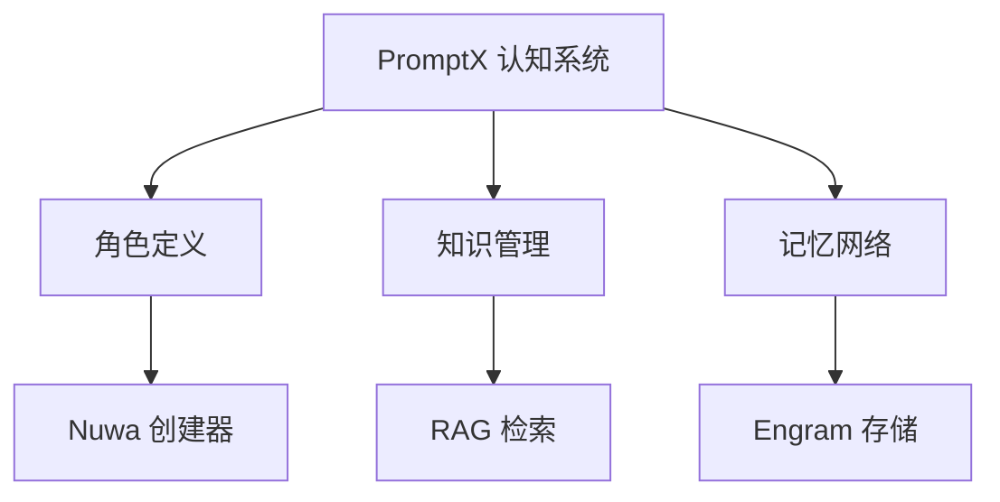

# 《Deepractice AI 智能体开发实战指南》章节重构建议

> **文档版本**: v2.0
> **创建日期**: 2025-12-19
> **状态**: 待执行
> **作者**: Writer AI (基于 Deepractice 组织技术栈分析)

---

## 📊 重构概述

### 核心调整

1. **保留章节**：第1-4章（通用基础）完全不动
2. **重构章节**：第5-8章聚焦 Deepractice 技术体系
3. **新增内容**：综合实战项目（第9-11章）
4. **调整定位**：第12章改为框架对比与选型

### 认知递进路径

```
第1-4章：理论 + 手写实践
    ↓
第5章：PromptX（灵魂）—— AI 的认知与记忆
    ↓
第6章：DPML（声明）—— 声明式定义智能体
    ↓
第7章：DARP（协议）—— 资源标准化管理
    ↓
第8章：AgentX（骨架）—— 工业级运行时框架
    ↓
第9-11章：综合实战项目
    ↓
第12章：框架对比与选型
```

---

## 📚 详细章节规划

### 第一部分：通用基础（保留）

#### ✅ 第1章：初识智能体
**状态**: 完全保留
**理由**: 通用概念，与 Deepractice 体系不冲突

**章节内容**:
- 1.1 什么是智能体？
- 1.2 智能体如何工作？
- 1.3 构建第一个智能体
- 1.4 智能体应用生态
- 1.5 习题与讨论

---

#### ✅ 第2章：智能体发展史
**状态**: 主体保留，2.5节末尾增加 Deepractice 预告
**理由**: 历史回顾，提供哲学思考

**建议微调**:
在 2.5 节"智能体爆发时代"末尾增加：

> 在众多智能体框架中，Deepractice 团队提出了一个独特的视角：**AgentX（行为骨架）+ PromptX（认知灵魂）**的双体系架构。不同于传统框架仅关注执行流程，Deepractice 认为智能体需要**认知能力**——角色定义、知识管理和长期记忆。我们将在第五章开始深入探讨这一创新设计。

---

#### ✅ 第3章：大语言模型基础
**状态**: 完全保留
**理由**: LLM 基础知识，必备前置

**章节内容**:
- 3.1 语言模型简史
- 3.2 提示工程基础
- 3.3 LLM 的能力与边界
- 3.4 从 LLM 到智能体架构

---

#### ✅ 第4章：智能体经典范式
**状态**: 完全保留
**理由**: 手写实践是学习框架的必要阶梯

**章节内容**:
- 4.1 环境准备与基础工具
- 4.2 ReAct 范式
- 4.3 Plan-and-Solve 范式
- 4.4 Reflection 范式
- 4.5 从手写到框架：AgentX 与 PromptX（已完美衔接第五章）
- 4.6 本章小结与练习

---

### 第二部分：Deepractice 技术体系（重点重构）

#### 🔥 第5章：PromptX 认知系统 - AI 的灵魂
**定位**: 从无状态 LLM 到有认知的专家
**写作风格**: 阮一峰式（亲切、通俗、层级清晰）
**学术支撑**: 引用认知科学、记忆理论相关论文

**章节结构**:

##### 5.1 PromptX 是什么？为什么需要它？
- **从痛点引入**（15分钟）
  - 回顾第4章：手写智能体的三大缺陷
    - 无状态：每次对话从零开始
    - 无记忆：无法积累用户偏好
    - 无人格：缺乏专业领域能力
  - 传统提示词的局限性
  - PromptX 的核心理念：**把 AI 当人看，不是当软件**

- **三大核心能力预览**
  - 角色定义（Role Definition）：AI 的"人格"
  - 知识管理（Knowledge Management）：AI 的"专业"
  - 记忆网络（Engram Memory）：AI 的"经验"

- **对比其他方案**
  - vs LangChain Memory：静态列表 vs 语义记忆网络
  - vs GPTs/Custom Instructions：单模型限制 vs 跨平台认知
  - 数据对比表格

- **番外：学术视角**
  - 认知科学中的"情境记忆"（Episodic Memory）理论
  - Tulving (1972) 记忆分类理论
  - PromptX Engram 的理论依据

---

##### 5.2 快速体验：5分钟启动你的第一个专家
- **安装 PromptX Desktop**（10分钟）
  - 三种安装方式：Desktop Client / Node.js / Docker
  - 配置 MCP 服务器（127.0.0.1:5203/mcp）
  - 连接 Claude / Cursor / VSCode

- **三个核心命令**
  ```bash
  # 发现可用资源
  discover()

  # 激活角色
  action(role="writer")

  # 回忆记忆
  recall(role="writer", query="如何去 AI 味")

  # 存储记忆
  remember(role="writer", content="...")
  ```

- **实战：对话 Writer 角色**
  - 体验有"人格"的 AI
  - 观察记忆网络图
  - 理解认知循环

---

##### 5.3 角色定义（Role Definition）
- **角色 YAML 文件结构**（20分钟）
  ```yaml
  role:
    name: "旅行规划师"
    identity: "资深旅行顾问，10年行业经验"
    expertise:
      - 行程规划
      - 景点推荐
      - 预算优化
    principles:
      - 以用户需求为中心
      - 提供真实准确信息
      - 考虑安全可行性
    personality:
      style: 友好专业
      tone: 热情但不过度
  ```

- **Nuwa：用自然语言创建角色**
  - "创建一个既懂代码又懂产品的技术 PM"
  - Nuwa 的工作流程
  - 实战示例

- **代码示例：激活角色**
  ```typescript
  // MCP 方式
  await mcp__promptx__action({ role: "travel-planner" });

  // SDK 方式
  import { PromptX } from '@deepractice/promptx';
  const agent = await PromptX.activate('travel-planner');
  ```

- **番外：角色工程 vs 提示工程**
  - 角色的持久性优势
  - 多会话一致性
  - 与 OpenAI GPTs 的对比

---

##### 5.4 知识管理（Knowledge Management）
- **为什么 AI 需要"外挂"知识？**（20分钟）
  - LLM 预训练知识的三大局限
    - 时效性：训练截止日期
    - 专业性：垂直领域深度不足
    - 私密性：企业内部知识

- **结构化知识组织**
  ```yaml
  knowledge:
    domain: "旅行规划"
    categories:
      - name: "目的地知识"
        sources:
          - type: "structured"
            path: "./destinations.json"
      - name: "签证政策"
        sources:
          - type: "rag"
            index: "visa_policies"
    retrieval:
      strategy: "semantic"
      top_k: 5
  ```

- **RAG 检索增强原理**
  - 向量化与语义检索
  - 动态知识加载机制
  - 性能优化技巧

- **实战：为旅行规划师注入景点知识库**
  - 准备数据（JSON/CSV）
  - 配置知识源
  - 测试检索效果

- **番外：RAG 技术对比**
  - LlamaIndex vs LangChain vs PromptX
  - 检索精度对比实验
  - 引用论文：Lewis et al. (2020) RAG 论文

---

##### 5.5 Engram 记忆网络（Memory Network）
- **认知科学启发：人类记忆的工作方式**（30分钟）
  - Atkinson-Shiffrin 记忆模型（1968）
  - 短期记忆（STM）vs 长期记忆（LTM）
  - 遗忘曲线（Ebbinghaus, 1885）

- **Engram 架构设计**
  ```
  ┌─────────────────────────────────┐
  │      Engram Memory Network      │
  ├─────────────────────────────────┤
  │                                 │
  │  短期记忆（STM）                 │
  │  ┌───────────────────────┐     │
  │  │ 当前会话上下文         │     │
  │  │ 容量：10-15 条消息    │     │
  │  │ 衰减：30 分钟         │     │
  │  └───────────────────────┘     │
  │           ↓ 重要性过滤           │
  │  ┌───────────────────────┐     │
  │  │ 长期记忆（LTM）        │     │
  │  │ • 语义索引            │     │
  │  │ • 向量存储            │     │
  │  │ • 衰减模拟            │     │
  │  └───────────────────────┘     │
  │                                 │
  └─────────────────────────────────┘
  ```

- **recall：语义检索与记忆召回**
  ```typescript
  // DMN 模式：扫描所有记忆域
  const memories = await recall(role="writer", query=null);

  // 精确模式：查找特定记忆
  const tips = await recall(
    role="writer",
    query="如何去 AI 味",
    mode="focused"
  );
  ```

- **remember：记忆存储与强化**
  ```typescript
  await remember({
    role: "writer",
    engrams: [{
      content: "用户偏好：喜欢阮一峰式的技术博客风格",
      schema: "用户偏好 阮一峰 技术博客 风格",
      strength: 0.8,
      type: "ATOMIC"
    }]
  });
  ```

- **记忆衰减曲线模拟**
  - 时间衰减公式
  - 重复强化机制
  - 遗忘阈值设定

- **实战：构建会"学习"用户偏好的智能体**
  - 场景：个性化新闻推荐
  - 记忆用户阅读历史
  - 动态调整推荐策略

- **番外：记忆系统技术对比**
  | 方案 | 短期记忆 | 长期记忆 | 语义检索 | 衰减模拟 |
  |------|---------|---------|---------|---------|
  | LangChain Memory | ✅ 列表 | ❌ | ❌ | ❌ |
  | GPT-4 Assistants | ✅ 线程 | ⚠️ 文件 | ⚠️ 基础 | ❌ |
  | MemGPT | ✅ | ✅ | ✅ | ❌ |
  | PromptX Engram | ✅ | ✅ | ✅ | ✅ |

  - 引用论文：Park et al. (2023) Generative Agents
  - 数据对比：召回精度、响应速度

---

##### 5.6 三大内置工具
- **Excel Tool：数据分析与报表生成**（15分钟）
  - 读取 Excel 文件
  - 数据分析（统计、透视）
  - 生成图表和报表
  - 实战案例：销售数据分析

- **Word Tool：文档创建与处理**
  - 文档模板系统
  - 内容提取与转换
  - 批量处理
  - 实战案例：合同批量生成

- **PDF Reader：智能文档解析**
  - 智能缓存机制
  - 结构化提取
  - OCR 支持
  - 实战案例：学术论文摘要

---

##### 5.7 Luban 工具集成
- **为什么需要工具集成？**（20分钟）
  - AI 的"手"和"眼"
  - 工具调用的标准化

- **三分钟接入外部 API**
  - ToolX 工具定义格式
  - 参数校验与类型系统
  - 错误处理机制

- **实战示例**
  - 数据库查询工具
  - 微信消息发送工具
  - 多 AI 平台链接（OpenAI + Claude）

- **番外：工具调用技术对比**
  - Function Calling vs Tool Use
  - 各大模型的工具调用能力对比
  - 引用：Schick et al. (2023) Toolformer

---

##### 5.8 Writer：去 AI 味的内容创作
- **AI 写作的三大问题**（25分钟）
  - 文风 AI 味：过于中性标准
  - 体验缺失：抽象概念多
  - 结构工整：每部分均衡

- **ISSUE 范式**
  ```
  1. Initiate（发起）：理解任务
  2. Socratic（对话）：获取私有信息
  3. Search（搜索）：获取公共信息
  4. Unify（整合）：融合+锚定风格
  5. Execute（执行）：写作+去 AI 味
  ```

- **对话式信息收集**
  - Friendly Advice Socratic
  - 递进式深入提问
  - 选项式引导

- **真实细节注入技巧**
  - 具象化转换公式
  - WebSearch 实时检索
  - 标点与格式人性化

- **实战：生成一篇技术博客**
  - 主题：AgentX 事件驱动架构
  - 风格：阮一峰式
  - 完整流程演示

---

##### 5.9 本章实战：知识管理助手
- **需求分析**（30分钟）
  - 场景：个人图书馆管理
  - 用户故事

- **角色设计：专业图书管理员**
  ```yaml
  role:
    name: "图书管理员"
    identity: "资深图书管理专家"
    expertise:
      - 图书分类（杜威十进制）
      - 阅读推荐
      - 笔记整理
  ```

- **知识库构建**
  - 图书元数据（ISBN、作者、标签）
  - 阅读笔记索引
  - 相关书籍关联

- **记忆系统**
  - 用户阅读历史
  - 兴趣偏好
  - 待读清单

- **完整代码实现**
  - TypeScript / Python 双版本
  - MCP 接口暴露
  - 测试与优化

- **番外：与其他方案对比**
  - vs Notion AI
  - vs Obsidian + GPT
  - 优势分析

---

##### 5.10 本章小结与展望
- **核心要点回顾**
  - 角色：AI 的人格
  - 知识：AI 的专业
  - 记忆：AI 的经验

- **PromptX 在 Deepractice 体系中的位置**
  ```
  PromptX（认知）
      ↓ 提供能力
  DPML（定义）+ DARP（协议）+ AgentX（运行）
  ```

- **下一章预告**
  > 现在你已经理解了 PromptX 的认知能力，但每次都要写代码配置吗？能否有更简单的方式？下一章我们将介绍 **DPML——声明式 AI 开发**，让你像写 HTML 一样定义智能体。

---

#### 🔥 第6章：DPML - 声明式 AI 开发
**定位**: 像写 HTML 一样写 AI
**写作风格**: 阮一峰式
**学术支撑**: 声明式编程范式、DSL 设计理论

**章节结构**:

##### 6.1 DPML 设计理念
- 从命令式到声明式的范式转变
- 为什么说"像写 HTML 一样写 AI"？
- 降低 AI 开发门槛的必要性
- 番外：DSL（领域特定语言）理论
  - Fowler (2010) Domain-Specific Languages
  - 成功的 DSL 案例：SQL、HTML、CSS

##### 6.2 DPML 核心语法
- 基本标签：`<agent>` `<llm>` `<prompt>` `<tools>`
- 环境变量：`@agentenv:`
- 与 PromptX 的集成
- 完整语法参考

##### 6.3 快速上手：10 行代码创建旅行助手
- DPML 文件编写
- 运行与测试
- 调试技巧

##### 6.4 与 PromptX 的协同
- 引用角色定义
- 调用 ToolX 工具
- 访问记忆网络

##### 6.5 实战：客户支持机器人
- 需求分析
- DPML 配置
- 测试优化

##### 6.6 番外：声明式 vs 命令式
- 代码对比
- 适用场景
- 未来展望

---

#### 🔥 第7章：DARP - 智能体资源协议
**定位**: 统一的资源发现与管理
**写作风格**: 阮一峰式
**学术支撑**: 协议设计、服务发现理论

**章节结构**:

##### 7.1 DARP 协议设计
- 为什么需要资源协议？
- 协议规范详解
- DARP vs MCP 的关系
- 番外：协议设计理论
  - RESTful API 设计原则
  - 服务发现协议对比

##### 7.2 资源类型与注册
- 角色资源
- 工具资源
- 知识库资源
- discover 机制实现

##### 7.3 DARP 在体系中的位置
- PromptX → DARP → 资源暴露
- DPML → DARP → 资源引用
- AgentX → DARP → 能力加载

##### 7.4 实战：企业级资源中心
- 架构设计
- 服务搭建
- 客户端接入

---

#### 🔥 第8章：AgentX 框架 - 工业级运行时
**定位**: 从玩具到生产的最后一公里
**写作风格**: 阮一峰式
**学术支撑**: 事件驱动架构、状态机理论、并发编程

**章节结构**:

##### 8.1 AgentX 简介与设计哲学
- 第4章手写代码的工程困境
- 事件驱动架构的优势
- 三大设计原则
- 番外：AgentX vs 其他框架
  | 框架 | 架构 | 并发 | 状态管理 | 可观测性 |
  |------|------|------|---------|---------|
  | AutoGen | 对话驱动 | 有限 | 简单 | 基础 |
  | LangGraph | 图驱动 | ❌ | DAG | 中等 |
  | AgentX | 事件驱动 | ✅ 异步 | 状态机 | 完整 |

##### 8.2 核心概念深度解析
- 四层事件系统
- Mealy 状态机
- Docker 式生命周期
- 番外：状态机理论
  - Finite State Machines (FSM)
  - Mealy vs Moore 机器对比
  - 引用论文：状态机在 Agent 系统中的应用

##### 8.3 快速开始：Hello AgentX
- 环境配置
- 最小示例
- 集成 PromptX
- 重写第4章 ReAct

##### 8.4 事件监听与调试
- 事件回调机制
- 日志系统
- 性能监控

##### 8.5 工具系统与扩展
- 工具注册表
- MCP 集成
- 与 PromptX ToolX 协同

##### 8.6 AgentRuntime：生产级部署
- 容器化部署
- 多用户支持
- 会话持久化
- 健康检查

##### 8.7 实战：多轮对话客服
- 架构设计（AgentX + PromptX + DARP）
- 完整实现
- Docker Compose 部署
- 番外：性能测试
  - 并发能力测试
  - 延迟分析
  - 与其他框架对比

---

### 第三部分：综合实战项目

#### 第9章：Buffett 价值投资智能体
- 完整技术栈应用
- 架构设计
- 核心实现
- 界面开发（Lucid-UI）
- 部署优化

#### 第10章：Lucid-UI - AI 原生设计语言
- AI-Native 理念
- 双主题系统
- 组件库
- 与 AgentX 集成

#### 第11章：AgentRuntime 生产部署
- 生产架构
- 监控与日志
- 故障恢复
- 性能调优

---

### 第四部分：框架对比与选型

#### 第12章：主流框架对比与选型
- 框架生态全景
- Deepractice 差异化优势
- 选型决策树
- 实战对比（同任务不同实现）
- 番外：框架演进趋势
  - 学术界最新研究
  - 工业界技术动向
  - 未来展望

---

## 🎨 写作风格规范

### 阮一峰式技术博客特征

**文字维度**:
- 词汇：亲切通俗，避免过度术语
- 句式：中等长度，逻辑分明
- 思维：类比多、举例多、图示多

**排版维度**:
- 层级清晰：标题分级规范
- 代码块多：完整可运行
- 列表丰富：有序列表为主
- 图示直观：流程图、架构图

**Emoji 使用**:
- 频率：每千字 0-2 个
- 类型：符号类（⚡📌🔍🎯✅）
- 位置：章节标题、关键提示

**示例**:
```markdown
## 为什么需要记忆系统？

想象一下，你去看医生，每次都要重新说明病史。医生完全不记得上次的诊断和用药。这样的医疗服务体验会很糟糕。

AI 智能体也是一样。如果每次对话都从零开始，用户体验会非常差。

**一个真实的例子**：

用户第一次问："我想去日本旅行，预算 1 万元。"
智能体给出方案 A。

隔天用户再问："有没有其他方案？"
没有记忆的智能体会回答："您想去哪里旅行？预算多少？"

这就是记忆系统的价值。
```

---

## 📊 学术支撑资源

### 需要引用的论文领域

**认知科学**:
- Atkinson & Shiffrin (1968) 记忆模型
- Tulving (1972) 情境记忆理论
- Ebbinghaus (1885) 遗忘曲线

**智能体架构**:
- Park et al. (2023) Generative Agents
- Yao et al. (2023) ReAct
- Wei et al. (2022) Chain-of-Thought

**工具调用**:
- Schick et al. (2023) Toolformer
- Qin et al. (2023) Tool Learning

**RAG 技术**:
- Lewis et al. (2020) RAG 原始论文
- Gao et al. (2023) RAG 综述

**状态机理论**:
- Finite State Machines in Agent Systems
- Mealy vs Moore Machines

---

## 🔄 执行计划

### 阶段一：内容准备（1周）
- [ ] 搜集学术论文
- [ ] 整理技术对比数据
- [ ] 准备代码示例
- [ ] 设计图示和流程图

### 阶段二：第5章重写（2周）
- [ ] 5.1-5.3 基础部分
- [ ] 5.4-5.6 核心技术
- [ ] 5.7-5.9 实战项目
- [ ] 5.10 小结与番外

### 阶段三：第6-8章编写（3周）
- [ ] 第6章 DPML
- [ ] 第7章 DARP
- [ ] 第8章 AgentX

### 阶段四：实战项目（2周）
- [ ] 第9章 Buffett
- [ ] 第10章 Lucid-UI
- [ ] 第11章 AgentRuntime

### 阶段五：框架对比（1周）
- [ ] 第12章完整重写

---

## ✅ 质量检查清单

### 内容质量
- [ ] 每个技术点有学术论文支撑
- [ ] 每个概念有具体代码示例
- [ ] 每节都有"番外"技术对比
- [ ] 数据和图表准确可信

### 写作风格
- [ ] 符合阮一峰式特征
- [ ] 通俗易懂，避免术语堆砌
- [ ] 层级清晰，逻辑严密
- [ ] 代码可运行，注释完整

### 读者体验
- [ ] 认知递进自然
- [ ] 实战案例完整
- [ ] 学习路径清晰
- [ ] 习题设计合理

---

## 📝 附录

### A. 参考文献格式

```
[1] Park, J. S., et al. (2023). Generative Agents: Interactive Simulacra of Human Behavior.
    arXiv preprint arXiv:2304.03442.

[2] Yao, S., et al. (2023). ReAct: Synergizing Reasoning and Acting in Language Models.
    ICLR 2023.

[3] Atkinson, R. C., & Shiffrin, R. M. (1968). Human memory: A proposed system and
    its control processes. Psychology of Learning and Motivation, 2, 89-195.
```

### B. 代码规范

**TypeScript 示例**:
```typescript
// PromptX Action 调用示例
import { mcp__promptx__action } from '@deepractice/promptx';

async function activateRole() {
  // 激活 Writer 角色
  const result = await mcp__promptx__action({
    role: 'writer'
  });

  console.log('角色激活成功:', result);
}
```

### C. 图示设计规范

**使用工具**: Mermaid / Draw.io
**风格**: 简洁、清晰、配色统一
**示例**:


---

**文档结束**

*这份重构建议将指导整个教材的改版工作，确保内容的系统性、学术性和实用性。*
